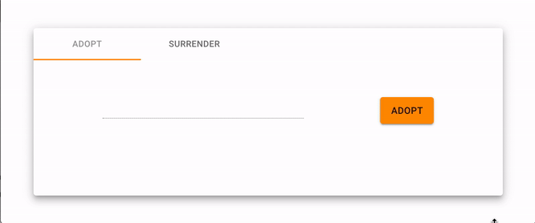
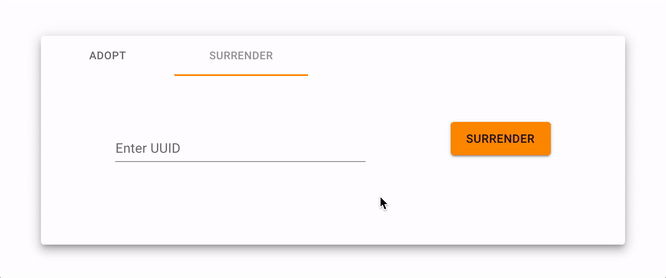

# UUID FARM - [FARM](https://uuid-farm.firebaseapp.com/) - [API DOCS](https://jesse0michael.github.io/uuid-farm/index.html)

A place for UUIDs to get a second chance at life. Abandon your no longer needed UUIDs to to farm where they will be cared for, or adopt a UUID that has left at the farm.

Frontend: https://uuid-farm.firebaseapp.com/

API Docs: https://jesse0michael.github.io/uuid-farm/index.html

---

_This project is obviously satire. A joke idea that I spent way to much time on, but it was time spent learning new technologies that I wanted some experience in. Here's the areas of interest that this project touches, which were all free!_

_**UPDATE**: deprecating the Heroku app since running this tool has no value. Below is a demo of what it used to look like when running._

## Demo

## Open API

API defined using the [OPEN API Specification](https://github.com/OAI/OpenAPI-Specification) - [openapi.yaml](api/openapi.yaml)

_After building APIs without documentation and APIs with generated documentation, APIs documentation first feels like the best option to me (Especially when paired with code generation). Openapi is an effective way to keep the API and clients in sync and plan for the routes you'll need before you jump into development._

## Code Generation

Go server generated using [Open API generator](https://github.com/OpenAPITools/openapi-generator) with changes made by me [#4038](https://github.com/OpenAPITools/openapi-generator/pull/4038) [#4196](https://github.com/OpenAPITools/openapi-generator/pull/4196) [#4400](https://github.com/OpenAPITools/openapi-generator/pull/4400). The Open API generator builds a convenient API skeleton separates the API routing and service logic into their own interfaces.

_When trying to use the go-server generated code I found it lacking from what I would normally build in a Golang API server. I saw the opportunity to actually contribute to a real open source repo and shed my imposter syndrome skin to improve the repo for #hacktoberfest2019. Adding and modifying the [mustache templates](https://mustache.github.io/mustache.5.html) that were used into something that I'm very pleased with._

Node Client generation the [typescript-node](https://github.com/OpenAPITools/openapi-generator/blob/master/docs/generators/typescript-node.md) Openapi generator to publish a npm package to use in a frontend.

_Generating the typescript client through the openapi tools went exactly how openapi code generation should be, requiring nothing more than one command with the appropriate configuration._

## Firestore Database

The document database provided through Google's Firebase called [Firestore](https://firebase.google.com/docs/firestore) for storing documents.

_In addition to Firebase's Hosting; this project uses Firebase's Firestore, A NoSQL database that I was excited to get some real experience using. The Firestore client was confusing to use in my [API Service](pkg/uuids/api_default_service.go) but, after following the documentation, worked perfectly._

## Github Actions

[Github Actions](https://help.github.com/en/actions/automating-your-workflow-with-github-actions) - CI built right into github using [workflows](.github/workflows/release.yml) defined in the repo.

_Like every new CI I've tried there is a lot of trial and error at first. I don't find that annoying, that's just part of the task. Github actions workflows are easy to build and work just like you would expect (for the most part). Running build steps in containers is the way to go but the star of this CI is pre-built, reusable, public actions. Putting the logic that you would normally copy and paste in every repo into a developed and configurable action that can run without having to manage dependencies is a beautiful thing._

## Github Packages

A public package repository to store and manage the [Go server docker image](https://github.com/Jesse0Michael/uuid-farm/packages/43229) and [Node client npm package](https://github.com/Jesse0Michael/uuid-farm/packages/48889) living right alongside the repository through [Github Packages](https://help.github.com/en/github/managing-packages-with-github-package-registry/about-github-package-registry).

## Heroku

Heroku to deploy the server application to accessed at https://uuid-farm.herokuapp.com/v1 through the docker image.

_I've been wanting an excuse to use Heroku. Setting up the application was easy and the cold start delay is not a problem at all (for a project that is a joke and will have zero usage)._

## React + Material UI

Front end built in [React](https://reactjs.org/docs/create-a-new-react-app.html) using [Material UI](https://material-ui.com/getting-started/installation/) styled components

## OpenAPI Docs

API documentation generated from the openapi.yaml spec through [ReDoc](https://github.com/Redocly/redoc).
